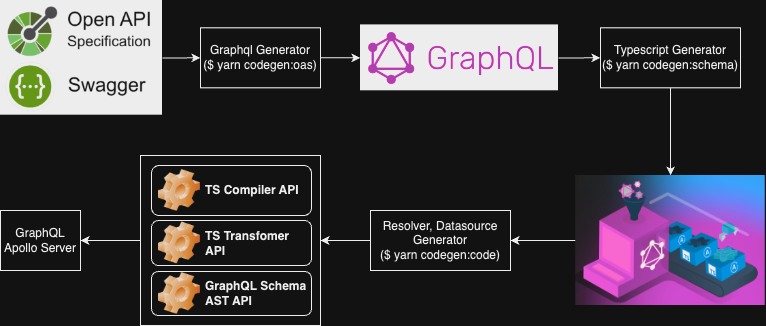

# rest-to-graphql

OpenAPI Specification(OAS)를 제공하는 REST API를 GraphQL 서버로 쉽게 구현할 수 있습니다.

Apollo Server + Fastify 기반으로 구성되어 있습니다.

## 주요 기술 스택

[Apollo Server](https://www.apollographql.com/docs/apollo-server/)

[Fastify](https://fastify.dev/)

[GraphQL Tools](https://the-guild.dev/graphql/tools)

[GraphQL Scalars](https://the-guild.dev/graphql/scalars)

[OpenAPI-to-GraphQL](https://github.com/IBM/openapi-to-graphql)

## Getting Started

## 개발 순서



1. `yarn codegen:oas` 명령을 통해 GraphQL Schema 생성
2. ***(중요)생성된 Schema와 기존 Schema 사이의 diff에서 유지하거나 생성해야 할 코드 확인하여 반영**
    1. production에 그대로 반영해야 할 query/mutation이 있다면 유지
    2. 유지해야 할 directives는 유지
    3. [union 타입의 경우 resolve 작성](https://www.apollographql.com/docs/apollo-server/schema/unions-interfaces/)을 해야 함(현재 `union.resolvers.ts`파일에 없는 타입의 경우 추가됨)
3. `yarn codegen:schema` 를 통해서 Schema를 기반으로 Typescript생성
4. `yarn codegen:code` 를 통해서 Schema의 Query, Mutation에 대한 코드를 생성
5. `yarn local` 을 수행하여 ts compile/validation 및 API 호출에 이상 없는지 확인

## 주요 개발 명령

### yarn local

개발 모드 입니다. 코드 변경 시 자동으로 서버를 재시작합니다.  
`src/schema` 내 스키마 파일이 수정되었을 경우엔 자동으로 `schema.graphql` 을 생성하기 위해 `yarn codegen:schema` 명령이 수행됩니다.

브라우저에서 https://localhost:4000/gql 로 API 문서와 쿼리를 수행해 볼 수 있습니다.

### yarn codegen:oas

OAS(OpenAPI Spec)을 기반으로 graphql 파일을 생성합니다.  
보통 Swagger로 배포되면 OAS파일을 받을 수 있으며 이를 통해 자동으로 graphql schema 파일을 자동으로 생성시키기 위한 스크립트(`codegen.oas.ts`)를 수행합니다.

새로운 Upstream REST API가 배포되었다면 스크립트를 수행하여 스키마 업데이트를 합니다.

업데이트 된 스키마는 기존 스키마의 변경 사항과 비교하여 머징을 합니다.

#### 💡중간에 에러 발생 시 단계별 command를 사용해 수행

단계를 나눈 이유는 OAS spec이 잘못 정의 되어 있어서 validation 에러가 발생될 경우가 있습니다.  
또는 파일 다운로드가 안될 수 있습니다. 이 때 단계별 수행을 통해서 해결합니다.

validation 에러 발생 시 [스웨거 에디터](https://editor.swagger.io/)에서 validation 에러를 해결한 텍스트를 가져와 다운받은 기존 OAS 파일을 덮어씌워 schema를 생성합니다.

또는 `codegen.ts` 파일의 `oasConfig` 객체내 `downloadAfterHook`을 이용하여 스펙 수정을 하는 코드를 넣어 validation error가 일어나지 않도록 합니다.

```
yarn codegen:oas
  OAS URL 정의에 따른 파일을 다운로드하고 스키마를 생성합니다.
yarn codegen:oas download
  OAS URL 정의에 따른 파일을 다운로드 합니다.
yarn codegen:oas schema
  OAS 이름 정의에 따른 graphql schema 파일을 생성합니다.
yarn codegen:oas clean
  OAS 파일을 제거 합니다.
```

### yarn codegen:schema

`codegen:oas`로 생성된 스키마를 기반으로 Type 추론을 위한 typescript를 생성(`graphql.ts`)합니다.  
이를 통해 Resolver의 arguments 및 query & mutation에 대한 타입 추론이 가능합니다.

### yarn codegen:code

GraphQL Schema 내 Query, Mutation을 토대로 REST API를 호출하는 Resolver와 Datasource파일을 생성하는 스크립트(`codegen.code.ts`)를 수행합니다.  
union type의 경우 union.resolvers.ts에 base code가 생성되며 function내 resolve하기 위한 코드를 구현해야 합니다.

### yarn start

Apollo 서버를 실행합니다. port는 4000번을 노출합니다.

## 참고 사항

Resolver파일은 `*.resolvers.ts`, Datasource파일은 `*.datasource.ts`파일명을 준수합니다.

Resolver파일과 Datasource는 `yarn codegen:code` 명령을 통해서 자동 생성시킵니다.  
드물겠지만 추가적인 로직이 있다면 별도 파일을 생성합니다.

OAS를 기반으로 Typescript를 생성하는 https://github.com/OpenAPITools/openapi-generator가 있지만 사용하지 않습니다. 불필요한 모델 및 코드조각들이 생성됩니다.

- OAS 기반으로 생성된 스키마가 validation check를 수행합니다.
- 응답값이 schema와 다르다면 에러가 발생되어 확인할 수 있습니다.
- 에러가 발생된 경우에는 Upstream API 서버에서 확인을 해주어야 하는 사항이므로 따로 타입 정의를 하지 않습니다.

생성된 resolver 내용을 그대로 사용할지 화면에 맞는 resolver를 직접 정의할지는 논의 후 결정 합니다.

## 개발시 주의사항

기본적으로 성능에 영향을 주는 비즈니스 로직과 파일 업로드는 처리하지 않습니다. 비즈니스 구현은 벡엔드에서 수행 합니다.

모든 Upstream API는 graphql을 사용하지 않고 실행 될 수 있도록 proxy를 제공합니다.

파일 업로드와 같은 multipart type은 사용하지 않습니다. 이러한 API를 사용한다면 proxy를 통해 Upstream API를 사용하여 요청해야 합니다.

VSCode의 `Run and Debug`를  최대한 많이 이용하여 디버깅을 진행합니다.

미구현 및 프론트에 알려야 하는 API에는 deprecated Directive를 적극 사용합니다.(Ex. `@deprecated(reason: "현재 미구현 되었습니다.")`

## 코드의 자동생성을 위한 규칙

1. codegen.ts 파일 내 oasConfig 객체내 name 속성 이름 패턴 주의
  - {UPSTREAM_NAME}-${API_TITLE}
  - 위와 같은 패턴을 지켜야 합니다.
  - resolvers, datasource 파일 이름과 datasource파일 내 class/baseURL 값을 결정합니다.
2. config.ts 파일 내 UPSTREAM_URL 객체 속성 키 이름은 {UPSTREAM_NAME} 의 UPPERCASE와 동일해야 합니다.